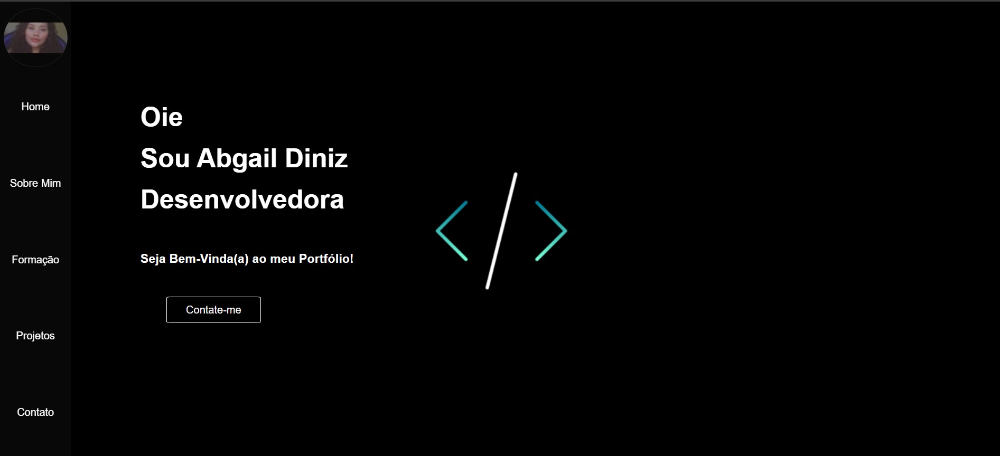

<h1 align="center">📑 My Portfolio </h1>

 O projeto foi desenvolvido utilizando as linguagens HTML, CSS e JavaScript. O portfólio ainda está em desenvolvimento e, em breve, receberá atualizações. O objetivo é adicionar o framework React, tornando a página mais interativa e com melhor desempenho.

 

 

## 💻 Projeto
<h3> O portfólio apresenta um pouco mais sobre as minhas experiências. </h3>

- [Visite o projeto online](https://abgail-diniz.github.io/portfolioAbgail/)

 

## 🚀 Tecnologias

Esse projeto foi desenvolvido com as seguintes tecnologias:

- HTML 
- CSS
- JavaScript
